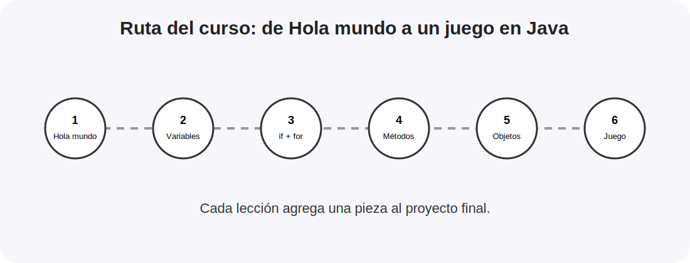

  

# Fundamentos de Java para Principiantes

### Documento de Plan de Curso para Responsabilidad Social - UPC Pre 2026

---

## Ruta de Aprendizaje

### Lección 1: Primer programa en Java (7 minutos)
- **Descripción**: Aprende la estructura mínima de un archivo de Java y cómo imprimir un mensaje en consola.
- **Conclusiones clave**: Estructura de la clase `Main`, método `main` como punto de entrada, `System.out.println` e importancia del punto y coma (`;`).

### Lección 2: Variables y tipos de datos (9 minutos)
- **Descripción**: Explora cómo almacenar datos en memoria usando variables con tipos definidos y unirlos en mensajes.
- **Conclusiones clave**: Declaración de variables, tipos primitivos (`int`, `double`, `boolean`) y complejos (`String`), tipado estático y concatenación con `+`.

### Lección 3: Condiciones y bucles (10 minutos)
- **Descripción**: Controla las decisiones de tu programa y repite tareas varias veces usando un contador.
- **Conclusiones clave**: Uso de `if`, `else if` y `else`, bucles `for`, diferencia entre comparación `==` y asignación `=`, y uso de `break` para salir del bucle.

### Lección 4: Métodos y entrada por consola (10 minutos)
- **Descripción**: Divide problemas grandes en piezas de código reutilizables y lee datos escritos por el usuario.
- **Conclusiones clave**: Creación y llamada de métodos estáticos, envío de parámetros, retorno de valor (`return`), e importación y uso de `Scanner`.

### Lección 5: Clases y objetos (12 minutos)
- **Descripción**: Comienza a modelar objetos reales con sus propios atributos protegidos y comportamientos.
- **Conclusiones clave**: Declaración de clases, instanciación con `new`, encapsulación de campos con `private`, constructor con `this` y métodos "getters".

### Lección 6: Encapsulación y proyecto final (12 minutos)
- **Descripción**: Desarrolla el juego "Aventura del Número Secreto" integrando estructuras, clases, entrada de usuario y validaciones.
- **Conclusiones clave**: Arquitectura modular con múltiples clases (`Game`, `Player`, `InputHelper`, `GameMessage`) y control del bucle de juego según las vidas.

  

---

## Tabla de Recursos

| Lección | Duración | Video del curso | Laboratorio Online | Contenido | Producto |
|---|---:|---|---|---|---|
| 01. Primer programa en Java | 7 min | [Ver lección](https://www.youtube.com/watch?v=PENDIENTE) | [Abrir Replit](https://replit.com/) | [Contenido](docs/lessons/lesson-01-hello-world/part-01-theory.md) | Mensaje en consola |
| 02. Variables y tipos de datos | 9 min | [Ver lección](https://www.youtube.com/watch?v=PENDIENTE) | [Abrir Replit](https://replit.com/) | [Contenido](docs/lessons/lesson-02-variables/part-01-theory.md) | Ficha de estudiante |
| 03. Condiciones y bucles | 10 min | [Ver lección](https://www.youtube.com/watch?v=PENDIENTE) | [Abrir Replit](https://replit.com/) | [Contenido](docs/lessons/lesson-03-if-loops/part-01-theory.md) | Intentos y pistas |
| 04. Métodos y entrada por consola | 10 min | [Ver lección](https://www.youtube.com/watch?v=PENDIENTE) | [Abrir Replit](https://replit.com/) | [Contenido](docs/lessons/lesson-04-methods/part-01-theory.md) | Calculadora simple |
| 05. Clases y objetos | 12 min | [Ver lección](https://www.youtube.com/watch?v=PENDIENTE) | [Abrir Replit](https://replit.com/) | [Contenido](docs/lessons/lesson-05-classes-objects/part-01-theory.md) | Modelo de jugador |
| 06. Encapsulación y proyecto final | 12 min | [Ver lección](https://www.youtube.com/watch?v=PENDIENTE) | [Abrir Replit](https://replit.com/) | [Contenido](docs/lessons/lesson-06-final-project/part-01-theory.md) | Aventura del Número Secreto |

---