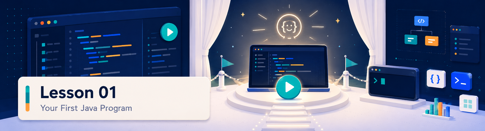

<p align="center">
  
</p>

<div align="center">

# Lección 01: Quiz y revisión

### Comprueba que entiendes tu primer programa Java

[](#)
[](#)
[](#)
[](#)
[](#)

</div>

> **Indicaciones:** selecciona la opción que consideres correcta marcando mentalmente la casilla. Luego despliega la respuesta para verificar tu comprensión. El objetivo no es memorizar, sino comprobar si puedes explicar el flujo con tus propias palabras.

---

<p align="center">
  
</p>

---

## Pregunta 1

**¿Cuál es el punto de entrada obligatorio para que cualquier aplicación Java comience a ejecutarse?**

- [ ] a) La primera línea del archivo `.java` que contenga código.
- [ ] b) El método `public static void main(String[] args)`.
- [ ] c) La clase pública llamada `Main` que envuelve el código.
- [ ] d) El archivo `README.md` que indica la configuración del proyecto.

<details>
<summary>Ver respuesta</summary>

**Respuesta correcta: b)**

Java busca exactamente el método `public static void main(String[] args)` para iniciar la ejecución del programa. Aunque el código esté dentro de una clase (como `Main`), si este método no existe o tiene un error tipográfico en su firma (por ejemplo, escribir `Main` con mayúscula o no poner `String[] args`), el compilador o la máquina virtual de Java (JVM) no sabrán por dónde empezar y marcarán un error.

</details>

---

## Pregunta 2

**¿Qué hace la instrucción `System.out.println("Hola");` al ejecutarse?**

- [ ] a) Envía un correo electrónico de bienvenida al programador.
- [ ] b) Crea una nueva clase en Replit de forma automática.
- [ ] c) Imprime el texto `"Hola"` en la consola y salta a la línea siguiente.
- [ ] d) Traduce el archivo Java a un ejecutable del sistema operativo.

<details>
<summary>Ver respuesta</summary>

**Respuesta correcta: c)**

`System.out.println` (abreviación de "print line") es la forma estándar en Java de enviar información a la salida estándar del sistema, que Replit muestra en el panel de la consola. El sufijo `ln` asegura que después de imprimir el texto entre comillas, el cursor salte a la siguiente línea, por lo que cualquier impresión posterior se verá abajo.

</details>

---

## Pregunta 3

**¿Qué ocurre en Java si omites el punto y coma (`;`) al final de una instrucción de impresión?**

- [ ] a) El navegador se cierra silenciosamente sin avisar.
- [ ] b) Java inserta automáticamente el punto y coma al compilar.
- [ ] c) El programa se ejecuta pero muestra el texto con errores de ortografía.
- [ ] d) Se produce un error de compilación inmediato indicando `';' expected`.

<details>
<summary>Ver respuesta</summary>

**Respuesta correcta: d)**

A diferencia de lenguajes de marcado como HTML o CSS que tienen "fallo silencioso", Java es un lenguaje estricto y con tipado fuerte. Cada instrucción individual debe cerrarse obligatoriamente con un punto y coma (`;`). Si falta, el compilador detendrá el proceso y mostrará el error literal en consola para que lo corrijas.

</details>

---

## Pregunta 4

**¿Qué significa que Java sea un lenguaje "Case-Sensitive" (sensible a mayúsculas)?**

- [ ] a) Que todo el código debe escribirse obligatoriamente en mayúsculas.
- [ ] b) Que Java distingue estrictamente entre letras mayúsculas y minúsculas.
- [ ] c) Que las variables con texto solo pueden almacenar palabras en mayúsculas.
- [ ] d) Que el compilador prefiere nombres largos sobre nombres cortos.

<details>
<summary>Ver respuesta</summary>

**Respuesta correcta: b)**

En Java, no es lo mismo escribir `System` que `system`, ni `main` que `Main`. Si escribes `system.out.println` con `s` minúscula, el compilador arrojará un error de tipo `cannot find symbol` porque no reconoce el contenedor del sistema. Debes ser muy preciso al tipear el código.

</details>

---

## Pregunta 5

**¿Cuál es la relación correcta entre el nombre del archivo de código fuente y la clase en Java?**

- [ ] a) Pueden llamarse de forma completamente diferente sin ningún problema.
- [ ] b) El archivo debe terminar con `.html` y la clase con `.java`.
- [ ] c) Si tienes una clase pública llamada `Main`, el archivo obligatoriamente debe llamarse `Main.java`.
- [ ] d) El nombre del archivo se asigna de forma aleatoria por el navegador.

<details>
<summary>Ver respuesta</summary>

**Respuesta correcta: c)**

En Java, la regla fundamental de organización exige que el nombre de la clase pública coincida de forma exacta y sensible a mayúsculas con el nombre del archivo físico en el disco (incluyendo la extensión `.java`). Por eso, en tu Repl inicial, el código vive dentro de `public class Main` y el archivo se llama `Main.java`.

</details>

---

## Pregunta 6

**¿Qué diferencia principal hay entre el "Editor" y la "Consola" en Replit?**

- [ ] a) El Editor muestra la memoria del sistema y la Consola muestra la velocidad de red.
- [ ] b) En el Editor escribes y modificas el código; en la Consola observas el resultado o la salida del programa al presionar **Run**.
- [ ] c) El Editor es para el profesor y la Consola es de uso exclusivo del alumno.
- [ ] d) No existe diferencia, ambos términos se refieren al mismo espacio web.

<details>
<summary>Ver respuesta</summary>

**Respuesta correcta: b)**

El Editor de Replit es tu área de escritura donde editas el archivo `Main.java`. La Consola (o Terminal) es la ventana negra o gris a la derecha donde la máquina virtual de Java muestra lo que imprimes con `System.out.println` y donde puedes interactuar con el programa una vez iniciado.

</details>

---

## Pregunta 7

**¿Cuál es el valor real de usar Replit en este curso en lugar de configurar herramientas en tu computadora local?**

- [ ] a) Hace que el código de Java corra más rápido que de forma local.
- [ ] b) Permite empezar a programar de inmediato en el navegador sin perder tiempo instalando Java, el JDK o configurando un IDE pesado.
- [ ] c) Replit escribe el código por ti de forma automática.
- [ ] d) Evita tener que conectarse a internet para hacer las prácticas.

<details>
<summary>Ver respuesta</summary>

**Respuesta correcta: b)**

Configurar un entorno local de Java (descargar el JDK, configurar variables de entorno en el sistema y elegir un IDE como IntelliJ) puede tardar más de una hora y provocar frustración inicial. Replit proporciona un entorno en la nube preconfigurado que funciona al instante en cualquier navegador web moderno, permitiendo que te enfoques únicamente en los fundamentos de programación.

</details>

---

## Pregunta 8

**¿Qué parte de la instrucción `System.out.println("Hola Estudiante");` puedes modificar de forma segura sin peligro de romper la estructura del programa?**

- [ ] a) El nombre de la clase `System`.
- [ ] b) La palabra `println` por cualquier otra palabra en español.
- [ ] c) Únicamente el texto que se encuentra dentro de las comillas dobles (por ejemplo, cambiar `"Hola Estudiante"` a `"¡Hola, mundo!"`).
- [ ] d) Las llaves externas `{}` del bloque de clase.

<details>
<summary>Ver respuesta</summary>

**Respuesta correcta: c)**

La firma de la clase, el método `main` y la estructura sintáctica de Java no son negociables para el compilador. Si los cambias al azar, el código fallará. Sin embargo, el texto plano dentro de las comillas dobles (un valor literal tipo `String`) es completamente libre: puedes escribir lo que quieras y se imprimirá tal cual en la consola.

</details>

---

<p align="center">
  
</p>

---

## Diagnóstico de errores

Identifica qué error de sintaxis tiene cada uno de los siguientes ejemplos antes de abrir el bloque desplegable.

### Caso A: El punto y coma olvidado

```java
public class Main {
    public static void main(String[] args) {
        System.out.println("Bienvenidos al curso de Java")
    }
}
```

<details>
<summary>Ver respuesta</summary>

**Explicación del error:**

Falta el punto y coma (`;`) al final de la línea de impresión. En Java, cada instrucción ejecutable debe cerrarse obligatoriamente con un `;`. El compilador de Java te lo advertirá de esta forma:
`error: ';' expected` en la línea correspondiente.

</details>

---

### Caso B: Las comillas abiertas

```java
public class Main {
    public static void main(String[] args) {
        System.out.println("Hola estudiantes);
    }
}
```

<details>
<summary>Ver respuesta</summary>

**Explicación del error:**

Falta cerrar las comillas dobles de la cadena de texto antes del paréntesis de cierre. Java no sabe dónde termina el texto que quieres imprimir y considera que toda la línea es parte de una cadena de texto sin terminar. El compilador reportará un error similar a:
`error: unclosed string literal`.

</details>

---

### Caso C: El uso incorrecto de minúsculas

```java
public class Main {
    public static void main(String[] args) {
        system.out.println("Hola Mundo");
    }
}
```

<details>
<summary>Ver respuesta</summary>

**Explicación del error:**

Se usó `system` con inicial minúscula en lugar de `System`. Java distingue mayúsculas y minúsculas de forma estricta. Como `system` no es una clase reconocida en el paquete básico, la compilación fallará diciendo:
`error: package system does not exist` o `error: cannot find symbol` apuntando a `system`.

</details>

---

<p align="center">
  
</p>

---

## Autoevaluación por niveles

### Nivel inicial
- [ ] Entiendo que el código Java debe estar guardado en un archivo con extensión `.java`.
- [ ] Puedo ubicar el botón **Run** en Replit y ver el texto impreso en consola.

### Nivel básico
- [ ] Identifico que el método `main` es el punto de inicio de la ejecución.
- [ ] Sé qué error ocurre si olvido poner un punto y coma (`;`) al final de una instrucción.

### Nivel sólido
- [ ] Explico por qué `System` empieza con mayúscula y `main` con minúscula basándome en las reglas del lenguaje.
- [ ] Puedo corregir de forma autónoma errores básicos de comillas sin cerrar o palabras mal tipeadas en el código inicial.

---

<div align="center">

**Volver al [plan de curso](../../../course-plan.md)**

</div>
