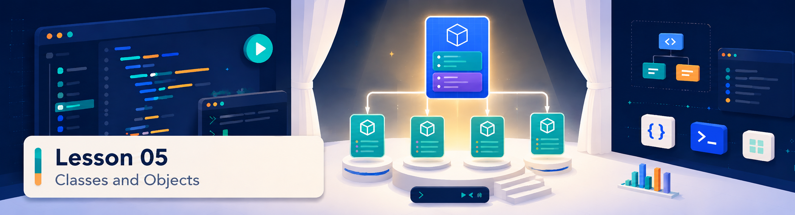

<p align="center">
  
</p>

<div align="center">

# Lección 05: Quiz y revisión

### Comprende el molde (Clase) y sus creaciones (Objetos) en Java

</div>

> **Indicaciones:** selecciona la opción que consideres correcta marcando mentalmente la casilla. Luego despliega la respuesta para verificar tu comprensión.

---

<p align="center">
  
</p>

---

## Pregunta 1

**En la Programación Orientada a Objetos, ¿cuál es la analogía o definición más correcta de una "Clase"?**

- [ ] a) El resultado final de la ejecución de una aplicación en Replit.
- [ ] b) Un molde, plano o plantilla que define los atributos (datos) y métodos (comportamientos) comunes que tendrán los objetos creados a partir de ella.
- [ ] c) Un tipo de dato primitivo que solo puede almacenar números enteros de gran escala.
- [ ] d) El conjunto de llaves `{}` que cierran el método `main`.

<details>
<summary>Ver respuesta</summary>

**Respuesta correcta: b)**

Una clase no es un objeto en sí, sino la plantilla conceptual que define cómo se construirá. Por ejemplo, la clase `Player` define que cada jugador tendrá un atributo `name` y un método `scorePoint()`, pero no representa a ningún jugador específico en memoria hasta que sea instanciada.

</details>

---

## Pregunta 2

**¿Qué es un "Objeto" o "Instancia" en el contexto de Java?**

- [ ] a) El archivo de texto plano `.java` que escribimos en el editor.
- [ ] b) Una copia o creación física y concreta en memoria basada en el plano de una Clase, con valores particulares y existencia propia.
- [ ] c) El comando que se usa para ejecutar el proyecto en la terminal.
- [ ] d) Un comentario dentro del código que documenta los avances del equipo.

<details>
<summary>Ver respuesta</summary>

**Respuesta correcta: b)**

El objeto es la realización física de la clase. Usando la analogía del plano arquitectónico (la Clase), el objeto sería la casa real construida en la calle (el Objeto). Puedes instanciar múltiples objetos independientes basados en la misma clase, y cada uno tendrá sus propios valores específicos (por ejemplo, el jugador `"Ana"` con nivel 3 y el jugador `"Luis"` con nivel 1).

</details>

---

## Pregunta 3

**¿Qué palabra clave reservada utiliza Java para reservar memoria y crear un nuevo objeto a partir de una clase específica (por ejemplo, `Player p = ___ Player();`)?**

- [ ] a) `class`
- [ ] b) `void`
- [ ] c) `new`
- [ ] d) `this`

<details>
<summary>Ver respuesta</summary>

**Respuesta correcta: c)**

La palabra clave `new` le indica a la máquina virtual de Java (JVM) que debe reservar el espacio de memoria dinámico necesario para un nuevo objeto del tipo especificado, y ejecutar inmediatamente el constructor correspondiente para inicializar sus atributos.

</details>

---

## Pregunta 4

**¿Qué es un "Constructor" en una clase de Java?**

- [ ] a) La herramienta de compilación integrada que genera archivos `.class`.
- [ ] b) Un método especial con el mismo nombre de la clase que se ejecuta automáticamente al crear una instancia con `new` para inicializar sus atributos.
- [ ] c) La variable que almacena la cantidad de objetos creados por el programa.
- [ ] d) Un tipo de datos que une enteros y decimales en una sola variable.

<details>
<summary>Ver respuesta</summary>

**Respuesta correcta: b)**

El constructor es el bloque de inicialización del objeto. Se define dentro de la clase y tiene dos reglas muy específicas en Java: debe llamarse exactamente igual que la clase (respetando mayúsculas) y no puede especificar ningún tipo de retorno (ni siquiera `void`). Es el encargado de recibir los parámetros iniciales para darle valores de partida a los atributos.

</details>

---

## Pregunta 5

**¿Cómo se denominan las variables declaradas dentro de una clase (fuera de los métodos) que representan las características, propiedades o estado de los objetos?**

- [ ] a) Parámetros
- [ ] b) Argumentos
- [ ] c) Atributos (o variables de instancia)
- [ ] d) Clases locales

<details>
<summary>Ver respuesta</summary>

**Respuesta correcta: c)**

Los **atributos** definen el estado de un objeto. Cada instancia del objeto almacena sus propios valores para estos atributos (por ejemplo, un atributo `health` en la clase `Player` guardará `100` para un jugador y `50` para otro). Estos atributos viven mientras el objeto siga existiendo en la memoria.

</details>

---

## Pregunta 6

**¿Para qué sirve la palabra clave `this` dentro de los métodos o constructores de una clase en Java?**

- [ ] a) Para finalizar la ejecución del constructor y salir del programa de inmediato.
- [ ] b) Hace referencia explícita al objeto actual que se está ejecutando, permitiendo diferenciar entre un atributo de la clase y un parámetro de método con el mismo nombre.
- [ ] c) Para duplicar la variable en un espacio de memoria temporal seguro.
- [ ] d) Sirve para heredar los comportamientos de otra clase de la biblioteca estándar.

<details>
<summary>Ver respuesta</summary>

**Respuesta correcta: b)**

Es muy común que los parámetros de un constructor tengan el mismo nombre que los atributos de la clase (por ejemplo, recibir `String name` en el constructor e inicializar el atributo `name`). Escribir `this.name = name;` le dice de forma clara a Java: "asigna el valor del parámetro `name` al atributo `name` de este objeto actual".

</details>

---

## Pregunta 7

**¿Qué operador se utiliza en Java para acceder a los métodos o atributos de un objeto que ya ha sido instanciado (por ejemplo, llamar a `saludar` en un objeto `jugador`)?**

- [ ] a) El operador flecha `->`
- [ ] b) El operador doble dos puntos `::`
- [ ] c) El operador punto `.` (ej: `jugador.saludar();`)
- [ ] d) El operador suma `+`

<details>
<summary>Ver respuesta</summary>

**Respuesta correcta: c)**

El operador punto `.` conecta la referencia de la variable del objeto con sus miembros públicos (atributos y métodos). Si escribes `jugador.health`, accedes a su valor de salud; si escribes `jugador.takeDamage(10);`, invocas el comportamiento para recibir daño sobre ese jugador en específico.

</details>

---

## Pregunta 8

**¿Qué ocurre en Java si intentas llamar a un método o acceder a un atributo a través de una variable de objeto que no ha sido instanciada (cuyo valor actual es `null`)?**

- [ ] a) El navegador corrige la llamada asignándole un objeto aleatorio.
- [ ] b) El código compila pero no realiza ninguna acción en consola.
- [ ] c) Se genera un error en tiempo de ejecución de tipo `NullPointerException` y el programa se detiene de golpe.
- [ ] d) El compilador detecta que es nulo y lo ignora de forma silenciosa.

<details>
<summary>Ver respuesta</summary>

**Respuesta correcta: c)**

Una variable de objeto que se declara pero no se inicializa con `new` apunta a `null` (la nada). Intentar navegar con el operador punto `.` sobre `null` genera la famosa excepción `NullPointerException`. Debes asegurarte de instanciar siempre tus objetos con `new` antes de llamarlos en el código.

</details>

---

<p align="center">
  
</p>

---

## Diagnóstico de errores

### Caso A: El constructor con tipo de retorno

Un estudiante escribe la clase `Player` pero al intentar compilarla, Java marca errores de tipo o no ejecuta el constructor esperado:

```java
public class Player {
    public String name;
    
    // Constructor con error
    public void Player(String inputName) {
        this.name = inputName;
    }
}
```

<details>
<summary>Ver respuesta</summary>

**Explicación del error:**

El estudiante agregó la palabra clave `void` en la declaración del constructor (`public void Player`). En Java, los constructores **nunca deben tener tipo de retorno**. Al ponerle `void`, Java ya no lo considera un constructor, sino un método ordinario que casualmente se llama `Player`. Cuando el estudiante intente inicializarlo con `new Player("Luis")`, Java fallará porque no encontrará el constructor sin tipo de retorno.

La solución correcta es eliminar la palabra `void`:
```java
public Player(String inputName) {
    this.name = inputName;
}
```

</details>

---

### Caso B: Acceso a objeto nulo

Un estudiante declara un objeto de clase `Player` y quiere restarle vida, pero el programa aborta su ejecución:

```java
public class Main {
    public static void main(String[] args) {
        Player jugador1 = null;
        jugador1.takeDamage(20);
    }
}
```

<details>
<summary>Ver respuesta</summary>

**Explicación del error:**

La variable `jugador1` apunta a `null`. Al intentar ejecutar `jugador1.takeDamage(20)`, Java busca el método `takeDamage` en un objeto físico que no existe, provocando un error fatal en tiempo de ejecución.

La solución correcta es crear la instancia del objeto antes de invocar el método:
```java
Player jugador1 = new Player("Carlos");
jugador1.takeDamage(20);
```

El error reportado en la consola de ejecución será:
`Exception in thread "main" java.lang.NullPointerException`.

</details>

---

<p align="center">
  
</p>

---

## Autoevaluación por niveles

### Nivel inicial
- [ ] Entiendo que una clase contiene la plantilla del código y que los objetos son las instancias de ese molde.
- [ ] Puedo crear un nuevo objeto usando la palabra clave `new` e imprimir uno de sus atributos en consola.

### Nivel básico
- [ ] Sé cómo escribir un constructor que reciba parámetros e inicialice los atributos de la clase usando la palabra clave `this`.
- [ ] Comprendo por qué un constructor no debe tener un tipo de retorno especificado (como `void`).

### Nivel sólido
- [ ] Puedo diseñar múltiples clases independientes (ej: `Player` y `TreasureRoom`) y hacerlas interactuar entre sí en un programa principal.
- [ ] Identifico y corrijo de forma proactiva problemas de referencia nula (`NullPointerException`) al llamar métodos de objetos.

---

<div align="center">

**Volver al [plan de curso](../../../course-plan.md)**

</div>
